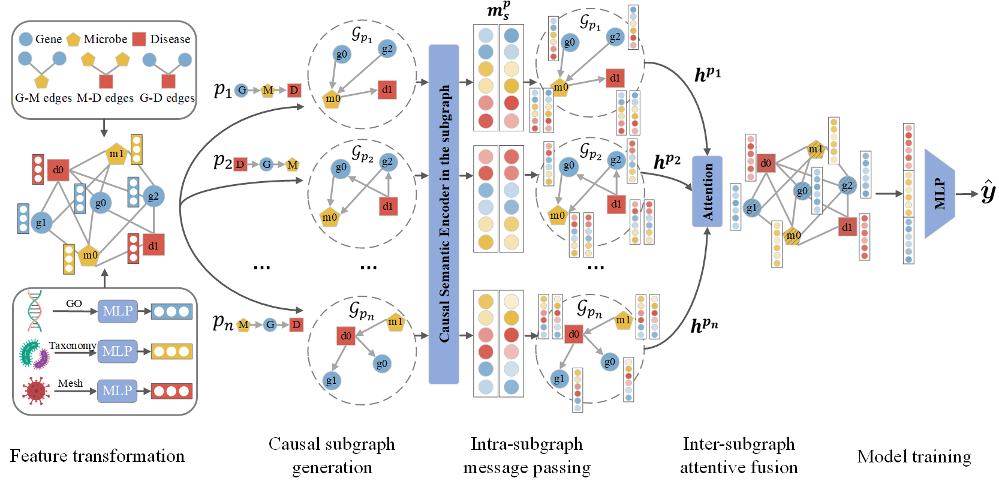

# HCMGNN
The code for "Heterogeneous Causal Metapath Graph Neural Network for Gene-Microbe-Disease Association Prediction (IJCAI 2024)".

# 1. File Descriptions
The repository is organized as follows:

- `Data/` contains the datasets used in the paper;
- `Utils/` contains the processing functions and tools;
- `data_process.py` contains reading the initial features and generate train and test samples;
- `train.py` contains the training and testing code of 5-fold CV and independent test experiments on datasets;
- `model.py` contains the components of the model.
- `main.py` main program of the repository;
# 2. Requirements
- python == 3.8.13
- ptorch == 1.9.0
- numpy == 1.21.0
- dgl == 0.6.0post1
- dglke == 0.1.2
- scikit-learn == 1.1.1
# 3. Example
Here we provide a example of using MCHNN , execute the following command:

`python main.py --loss_gamma 0.7 --lr 0.005`
